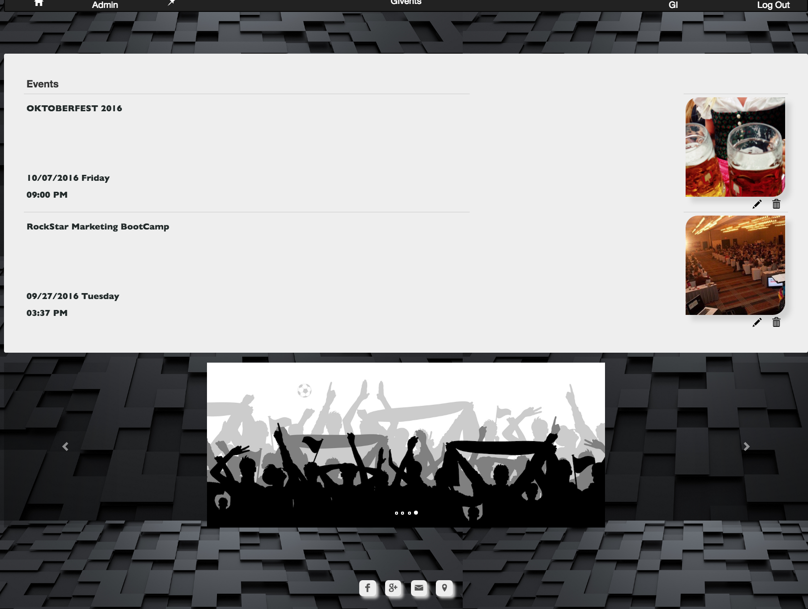
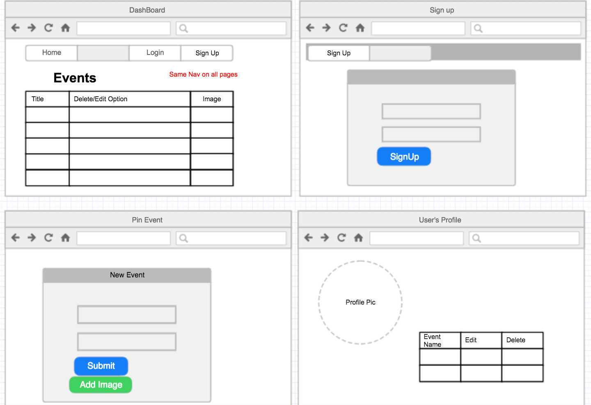
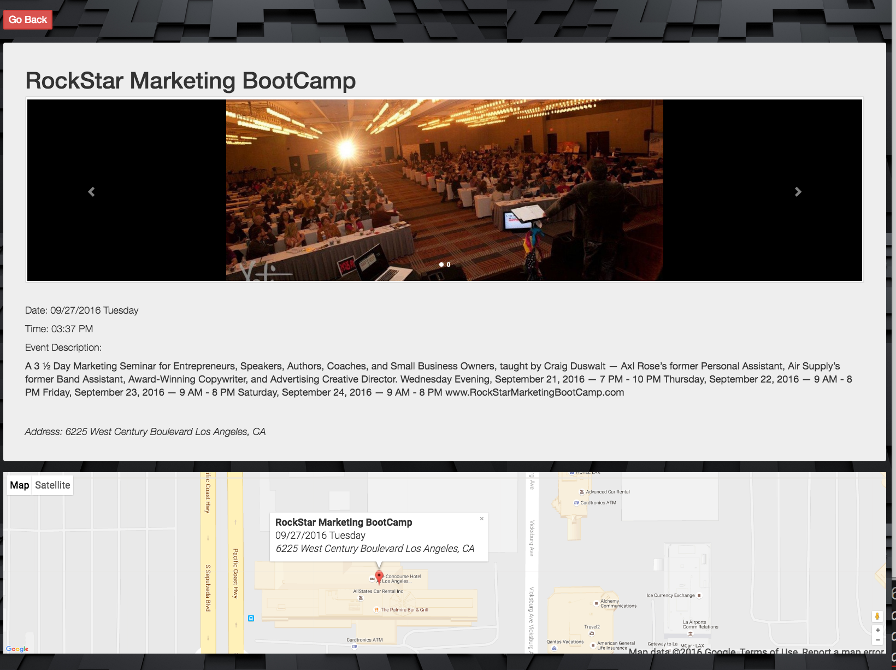
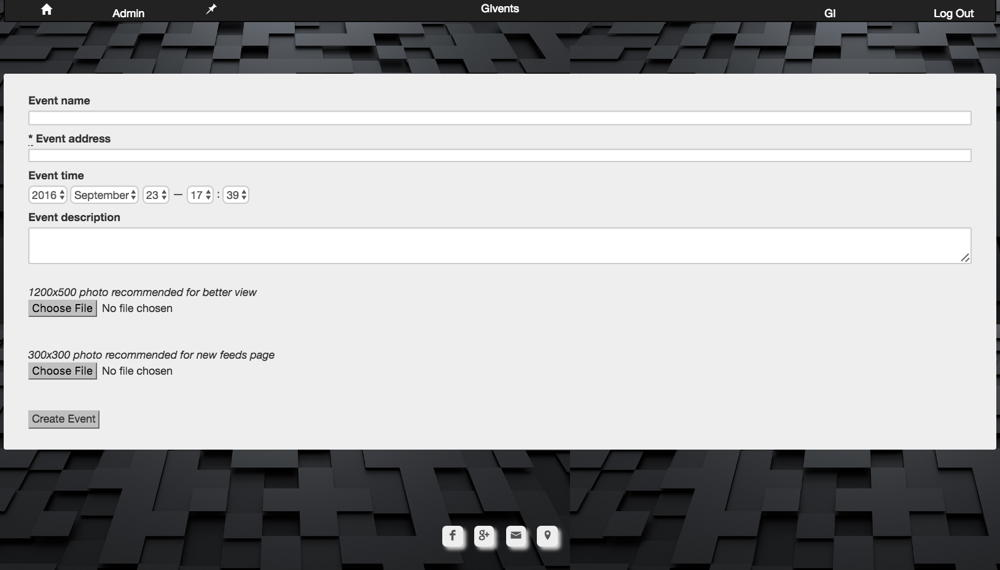
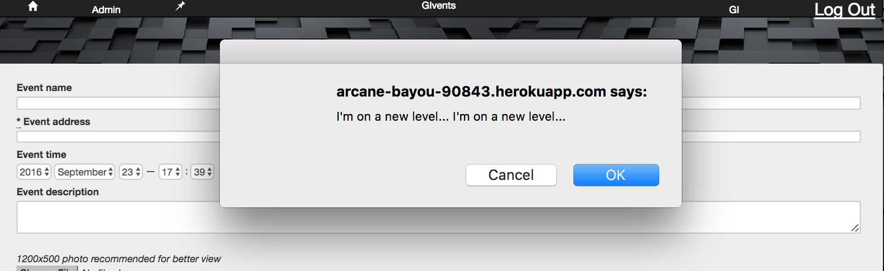

#[GIvents](http://arcane-bayou-90843.herokuapp.com/)
---
###About Game:
An events site where user can phost events and reach out the peoples for invitaion.  
[Visit site here](http://arcane-bayou-90843.herokuapp.com/)

Dash board of the site:

---

###Content
*	Access to site
	1. Remote
	2. Locally
* Instructions
* App Structure
* Technology Used
* Lags
* User Stories
* Future implementations
* Contribution
* Acknowledgements

---

###Access to site
1. Remote 
Site is intended to be functional and responsive with features like signing up, logging in users adn posting an high end events. App can simply accessed by simply clicking [here](http://arcane-bayou-90843.herokuapp.com/) since the site is live remotely powerd by heroku

2. Locally 
Download the entire contents and open with your editor.
Recommended Postgresql but not required.
Amazon S3 services required for photo upload functionality
Browsers: chrome, opera, firefox, safari, IE8 and above,

###Instructions:
Normal event's site, where user can post high end events for marketing or sharing. 
Posted events can be viewed in dashboard.
In order to post the event one should create an account with [GIvents](http://arcane-bayou-90843.herokuapp.com/) 
App is simple create account, event and share

### App Structure
 

Image to show the skeleton of site with minimal design to provide peripheral idea on app 

---

###Technology Used:
*	Framework: MVC Ruby rails
*	Database: Postgresql
* 	HTML, CSS(Sass, Less), Bootsrap
*	Site Hosting: Heroku
*	Photo Hosting: Amazon S3 services
*	Google Map API
* 	JQuery

---

###Lags
For Users:
*	Site with limited with only two event image
*	If user dont post event image it gives default image which was actually supposed to skip that slide of image
* 	Go back button should track the previous URI route

For Admin:
*	Should have decent Admin module
* 	Stupid access to Admin, should add more logic in back end

###User Stories
User POV:

1.	As a user, I can post and share my events.
3. As a user, I can view all listed events.
3. As a user, I can access my profile.
4. As a user, I can delete my events any time.
5. As a user, I have personalize URI which I can further share the page to other sites or social media.
7. As a user, I can post and access my event via phone.
8. As a user, I can track down event location easily using embedded google map API.
9. As a user, I can click on the map[:content] to hunt down quick event info useing google map

Admin POV:

1. As a admin, I can view all user's info.   

---

###Future implementations
1. Site certainly need an strong Admin end.
2. User should have ability to post more event's image
3. User should be able to change profile picture after signing up.
4. While updating the event choose file should contain the existing image file.

###Contribution:
*	Fork it and enjoy playing with it
*	Make suggestions for improvements and or enhancements
 

###Acknowledgements:
Credits: 

* [Eventbrite](https://www.eventbrite.com/) (events info used for site)

* Gems:

Gem| Author/Authors
--------------|------
[simple_form](https://rubygems.org/gems/simple_form)|José Valim, Carlos Antônio, Rafael França
[bootstrap-sass](https://rubygems.org/gems/bootstrap-sass)|Thomas McDonald
[paperclip](https://rubygems.org/gems/paperclip)|Jon Yurek
[aws-sdk](https://rubygems.org/gems/aws-sdk)|Amazon Web Services
[bcrypt](https://rubygems.org/gems/bcrypt)|Coda Hale
